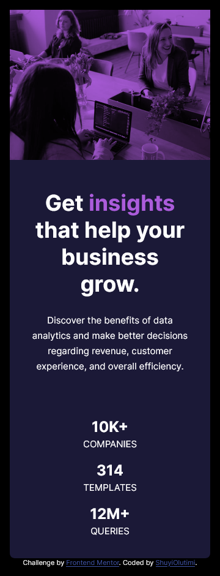

# Frontend Mentor - Stats preview card component solution

This is a solution to the [Stats preview card component challenge on Frontend Mentor](https://www.frontendmentor.io/challenges/stats-preview-card-component-8JqbgoU62). Frontend Mentor challenges help you improve your coding skills by building realistic projects.

## Table of contents

- [Overview](#overview)
  - [The challenge](#the-challenge)
  - [Screenshot](#screenshot)
  - [Links](#links)
- [My process](#my-process)
  - [Built with](#built-with)
  - [What I learned](#what-i-learned)
- [Author](#author)

## Overview

### The challenge

Users should be able to:

- View the optimal layout depending on their device's screen size

### Screenshot




### Links

- Solution URL: [Add solution URL here](https://github.com/ShuyiOlutimi/Frontend-Mentor-Stat-Preview-Card)
- Live Site URL: [Add live site URL here](https://shuyicardcomponent.netlify.app/)

## My process

I started with the HTML first. I am very particular about accessibility, so my first concern was to ensure that I have an HTML that was meaningful without any styling.

This influenced how I approached the hero image. I was going to insert the image as a url() background-image via CSS and then use an rgba() to add the purple overlay as a background-color but I realised it would pass no meaning to persons using screen readers. Additionally realized that I would not be able to use multiple sources for the image if inserted as a background. So I used the srcset attribute with the img tag.

So I included the hero image as an img tag, added an alt text and achieved the pink overlay using mix-blend-mode instead. Now everyone can appreciate the page and not just visual users.

### Built with

- Semantic HTML5 markup
- CSS custom properties
- Flexbox

### What I learned

Learnt to use the srcset attribute of the img tag

```html
<article class="hero-image">
  
</article>
```

```css
.hero-image {
  background-color: var(--clr-lightpurple);
}

.hero-image img {
  object-fit: cover;
  height: 100%;
  mix-blend-mode: multiply;
}
```

## Author

- E-mail - [Olutimilehin Olushuyi](shuyi@shuyiolutimi.com)
- Frontend Mentor - [@ShuyiOlutimi](https://www.frontendmentor.io/profile/ShuyiOlutimi)
- Twitter - [@ShuyiOlutimi](https://www.twitter.com/ShuyiOlutimi)